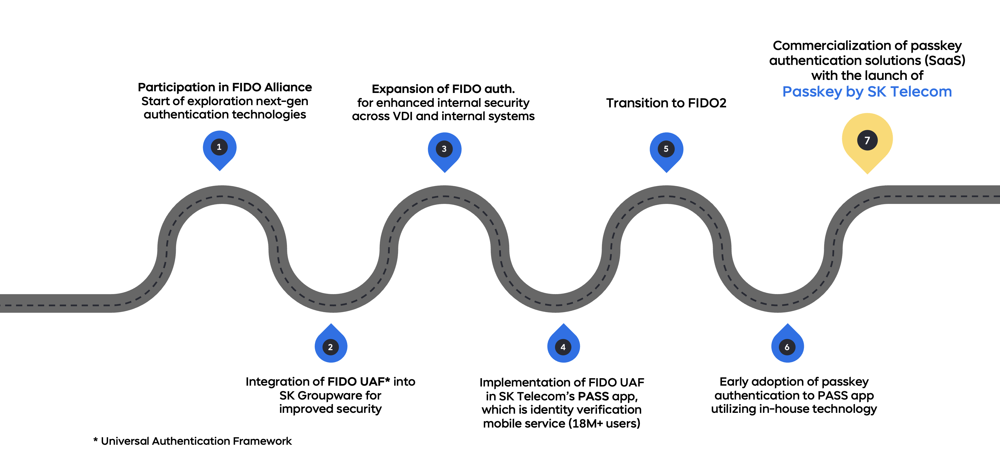
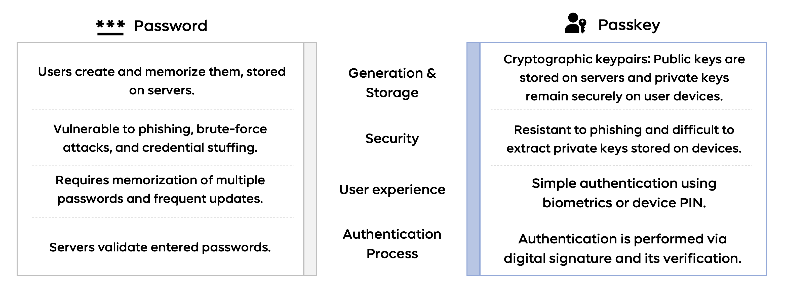
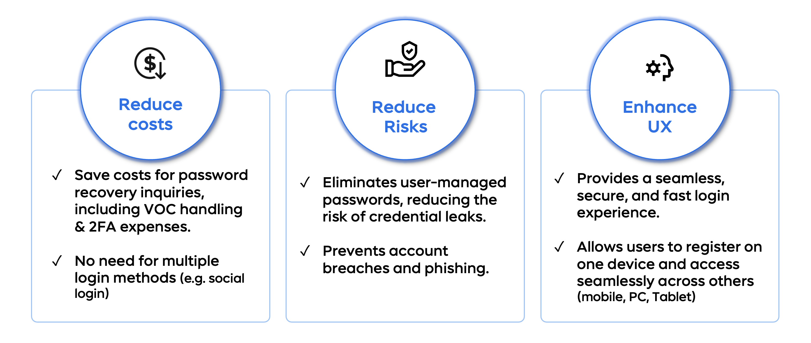
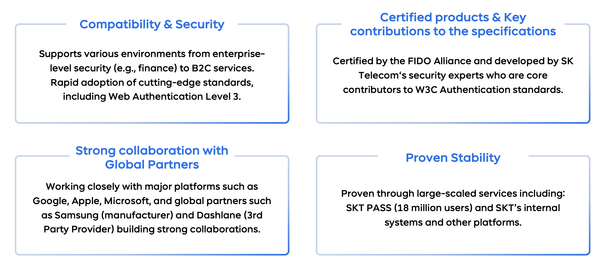

# Welcome to Passkey by SK Telecom

  

> Secure. Simple. Seamless.  
> Powering next-generation authentication with passkeys.

---

## About Us

We are the team behind **[Passkey by SK Telecom](https://passkey.sktelecom.com)** — a leading passkey implementation
focused on strong, passwordless authentication.  
Our mission is to enable secure and seamless login experiences across web and mobile platforms, with developer-friendly
integration and enterprise-grade reliability.

We actively contribute to open standards, build scalable infrastructure, and support large-scale deployments of
passkey-based authentication technologies.

### Our 10 years Journey in Passwordless Authentication

---

## Transition from passwords to passkeys

Passkeys offer a **safer** and **more seamless** alternative to traditional passwords.
Based on public key cryptography, passkeys authenticate users using device-bound credentials such as biometrics or
device PINs — without transmitting shared secrets.
This approach significantly enhances both security and user experience across platforms.

---

## Benefits

Adopting passkeys helps reduce operational costs, improve user experience, and strengthen personal data protection.
By eliminating password-related support overhead and enabling seamless authentication, organizations can streamline
onboarding, enhance trust, and unlock new revenue opportunities through secure digital experiences.

---

## Key Features & Strengths

---

## Open Source Projects

We are in the process of open-sourcing key components of our platform.  
Stay tuned for announcements and opportunities to collaborate.

---

## Contact

- Developer Q&A: [GitHub Discussions](https://github.com/orgs/skt-passkey/discussions)
- Email: `passkey [at] sk.com`
- Website: [passkey.sktelecom.com](https://passkey.sktelecom.com)
- Partner Portal: [portal.passkey-sktelecom.com](https://portal.passkey-sktelecom.com)

---

Let’s build a safer, passwordless world — together.
